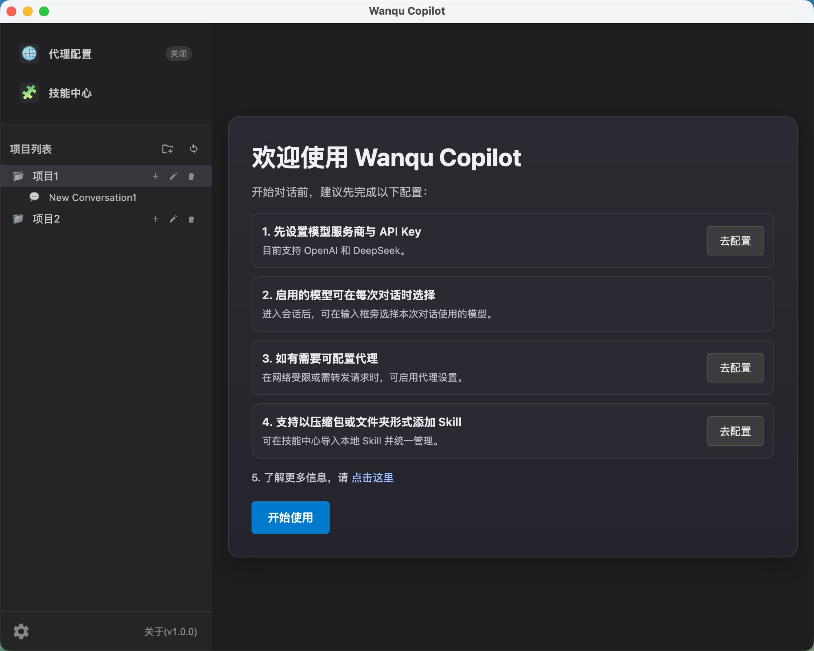
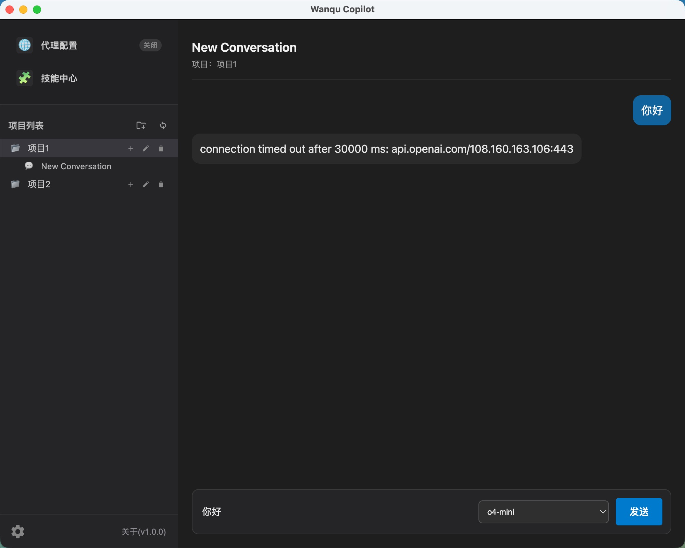
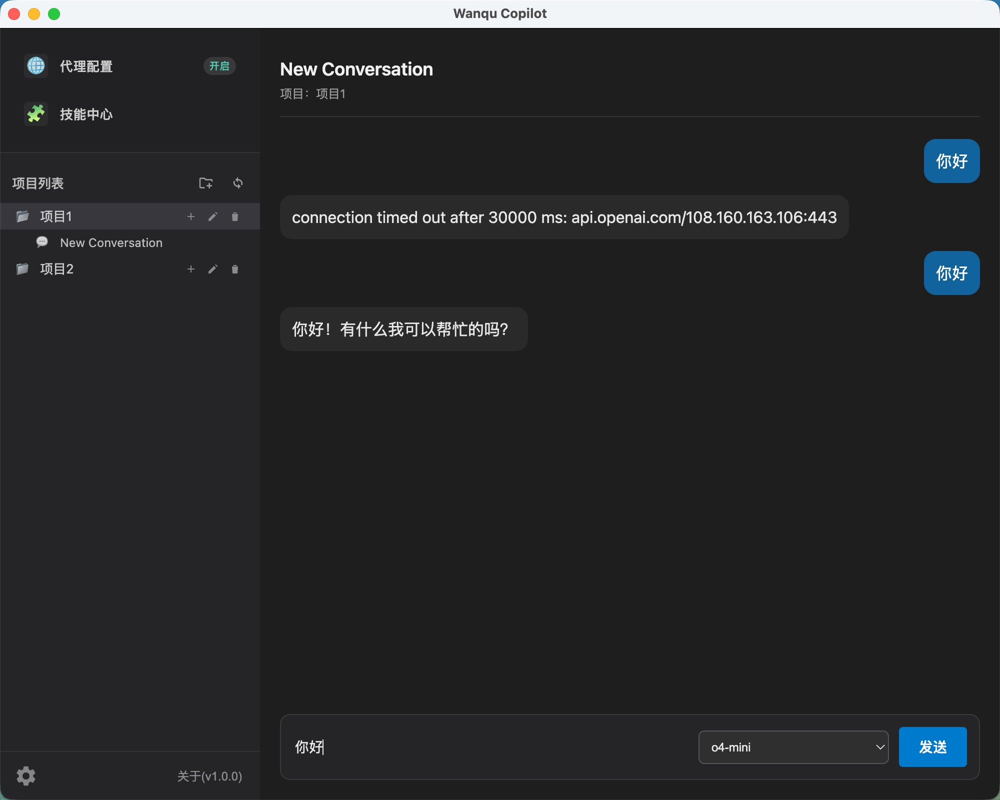

# Wanqu Copilot

A minimal desktop Copilot demo app. More info https://www.wanqu.chat/

## Preview



This project is a **simplest-possible desktop Copilot example** built with:

- **Java 17** + **Spring Boot 3** (app lifecycle, config)
- **JCEF** (JetBrains Chromium Embedded Framework) as the desktop WebView
- A small **JSBridge** for Native ↔ Browser communication
- **SQLite** for local data persistence

> This repo is intended as a demo / reference implementation.

## Features

- Desktop window powered by JCEF WebView
- Native ↔ Web communication via message-based JSBridge
- Local persistence (SQLite)
- Packaging via `jpackage` (macOS app-image)

## Requirements

- JDK 17+
- Maven 3.9+

## Build

```bash
mvn -DskipTests package
```

## Run (dev)

```bash
mvn spring-boot:run
```

## Package (macOS)

This repo contains a macOS packaging script using `jpackage`:

```bash
./build.sh
```

The generated app-image will be under:

- `dist/mac-amd64/WanquCopilot.app`

### Bundling JCEF

If you have a pre-downloaded JCEF directory, you can bundle it into the `.app` to avoid runtime download:

```bash
JCEF_SRC_DIR=./jcef ./build.sh
```

The script copies it to `WanquCopilot.app/Contents/Resources/jcef`.

## Proxy (dynamic toggle)

This demo supports **enabling/disabling proxy at runtime** from the UI.

- When proxy is **enabled**, API requests will route through the configured proxy.
- When proxy is **disabled**, API requests go out directly.

### Disable proxy



### Enable proxy



## License

MIT — see [`LICENSE`](./LICENSE).
